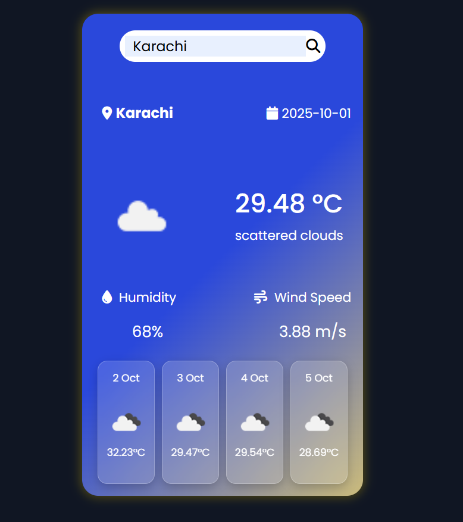

# 🌦️ Weather Dashboard App

A sleek and responsive **Weather Dashboard** that allows users to search for any city and view:

* Current weather details (temperature, condition, humidity, wind speed)
* 4-day weather forecast
* Dynamic icons and clean UI

Built with **HTML, CSS, JavaScript, Bootstrap 5, and OpenWeather API (via RapidAPI)**.

---

## 🚀 Features

✅ Search weather by city name
✅ Display **current weather** with icons
✅ Show **date and city location**
✅ Provide **humidity & wind speed** info
✅ 4-day weather forecast with formatted dates
✅ Responsive and modern UI (Bootstrap + custom CSS)

---

## 📸 Preview



---

## 🛠️ Tech Stack

* **Frontend**: HTML5, CSS3, Bootstrap 5, Font Awesome
* **Scripting**: JavaScript (Fetch API, async/await)
* **API**: OpenWeather API (via RapidAPI)
* **Geocoding**: Nominatim OpenStreetMap

---

## ⚙️ Setup & Installation

1. Clone the repository

   ```bash
   git clone https://github.com/YourUsername/Weather-Dashboard.git
   cd Weather-Dashboard
   ```

2. Open `index.html` in your browser

3. (Optional) Update the **API Key** in `weather.js`:

   ```js
   const options = {
       method: 'GET',
       headers: {
           'x-rapidapi-key': 'YOUR_API_KEY',
           'x-rapidapi-host': 'open-weather13.p.rapidapi.com'
       },
   };
   ```

---

## 📂 Project Structure

```
Weather-Dashboard/
│── index.html
│── weather.css
│── weather.js
│── assets/
│    └── weather/ (icons like clear.svg, etc.)
│    └── preview.png
```

---

## 🔑 API Usage

* **OpenWeather API (via RapidAPI)** → Provides current weather and forecasts
* **Nominatim OpenStreetMap API** → Converts city name to latitude/longitude

---

## 🌍 Demo

🔗 [Live Demo](https://yourusername.github.io/Weather-Dashboard) *(Add GitHub Pages link when deployed)*

---

## 📌 Future Improvements

* Add **hourly forecast**
* Add **search history**
* Implement **dark/light theme toggle**
* Support **multiple units** (°C/°F, m/s/mph)

---

## 👨‍💻 Author

Developed with ❤️ by **[Sarhan](https://github.com/SarhanCoderOfTheCentury)**

---

